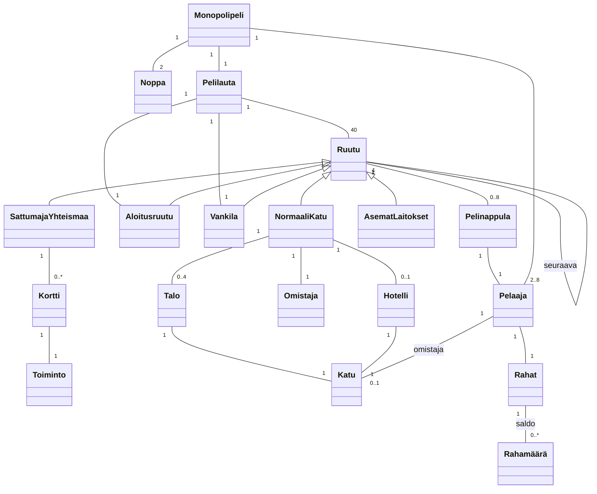

## Monopoli, alustava luokkakaavio

```mermaid
classDiagram
    Monopolipeli "1" -- "2" Noppa
    Monopolipeli "1" -- "1" Pelilauta
    Pelilauta "1" -- "40" Ruutu
    Ruutu "1" -- "1" Ruutu : seuraava
    Ruutu "1" -- "0..8" Pelinappula
    Pelinappula "1" -- "1" Pelaaja
    Pelaaja "2..8" -- "1" Monopolipeli
    Pelilauta "1" -- "1" Aloitusruutu
    Pelilauta "1" -- "1" Vankila
    Ruutu <|-- Aloitusruutu
    Ruutu <|-- Vankila
    Ruutu <|-- Sattuma ja Yhteismaa
    Sattuma ja Yhteismaa "1" -- "0..* " Kortti
    Kortti "1" -- "1" Toiminto
    Ruutu <|-- AsematLaitokset
    Ruutu <|-- NormaaliKatu
    NormaaliKatu "1" -- "1" Omistaja
    NormaaliKatu "1" -- "0..4" Talo
    NormaaliKatu "1" -- "0..1" Hotelli
    Talo "1" -- "1" Katu
    Hotelli "1" -- "1" Katu
    Pelaaja "1" -- "1" Rahat
    Rahat "1" -- "0..*" Rahamäärä : saldo
    Pelaaja "1" -- "0..1" Katu : omistaja
```
