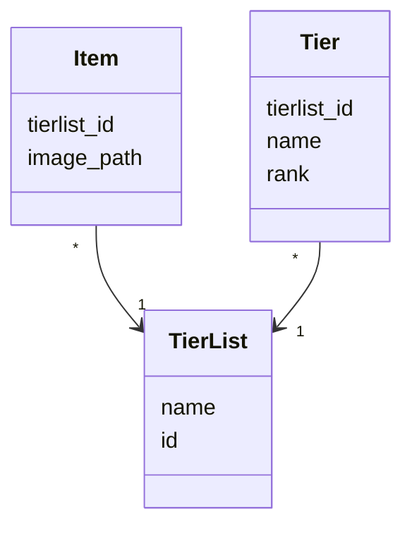
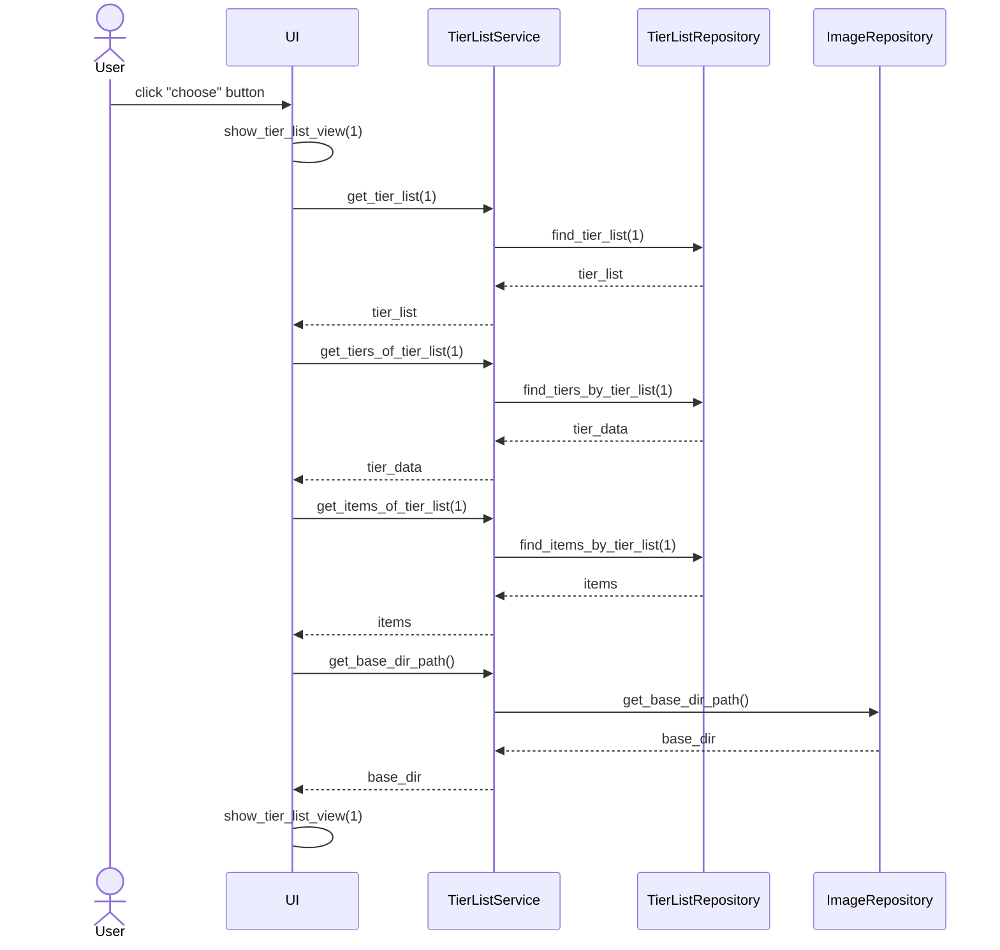

# Arkkitehtuurikuvaus

## Luokkakaavio

## Päätoiminnallisuudet

Sekvenssikaavioita oleellisista toiminnallisuuksista.

### Valmiin tier listin valitseminen

Kun sovelluksessa on listattuna valmis tier list 'Programming Languages' jonka id on 1 ja käyttäjä klikkaa listin *choose* nappia tapahtuu seuraavaa:

Painikkeen painamisella ensin siirrytään tier_list_view sivulle. Sitten kutsutaan sovelluslogiikan `TierListService` eri metodeja parametrina tier listin id. Näillä kerätään `TierListRepository`:n avulla tier listin, sen eri esineiden/asioiden ja tierien dataa. Data käsitellään UI:lle sopivaan muotoon ja jäädään tier_list_view näkymään.