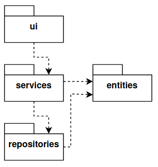
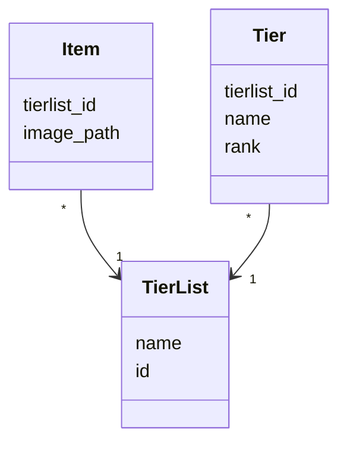
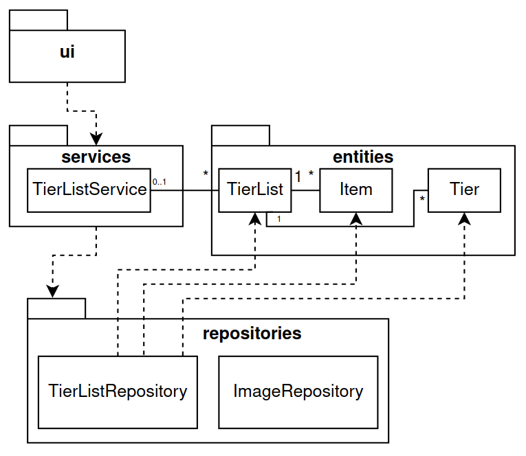
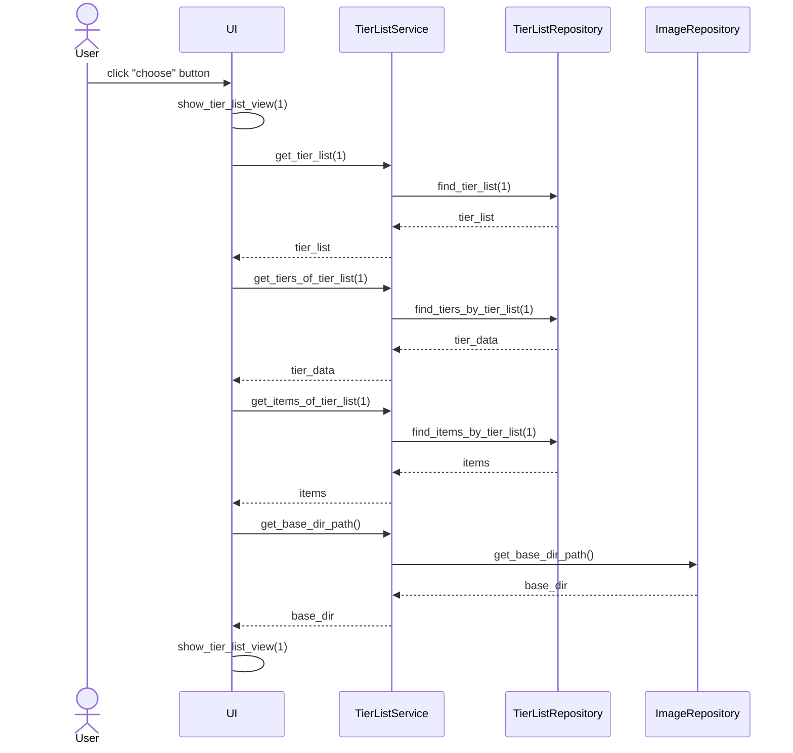

# Arkkitehtuurikuvaus

## Rakenne

Ohjelman rakenne noudattelee referenssisovelluksen mukaista rakennetta eli kolmitasoista kerrosarkkitehtuuria. Koodin pakkausrakenne on seuraava:

Pakkaus _ui_ sisältää käyttöliittymästä ja _services_ sovelluslogiikasta vastaavan koodin. _repositories_ sisältää koodin sekä tietojen pysyväistallennukselle, että kuvien polku- ja latausoperaatioille. Pakkaus _entities_ sisältää luokat, jotka kuvaavat sovelluksen käyttämiä tietokohteita.

## Käyttöliittymä

Käyttöliittymä sisältää kolme eri näkymää:

- Lista eri tier listeistä
- Uuden tier list pohjan teko
- Valmiin tier list pohjan käyttö

Listanäkymä on omassa luokassaan, mutta uusi ja vanha tier list pohja jakaa saman luokan. Näkymät ovat aina yksi kerrallaan näkyvissä ja näiden näyttämisestä vastaa [UI](../src/ui/ui.py)-luokka. Kuten pakkausrakenteeseen on kuvattu, käyttöliittymä on eritytetty kutsumaan vain [TierListService](../src/services/tier_list_service.py)-luokan metodeja.

## Sovelluslogiikka

 Luokat [TierList](../src/entities/tier_list.py), [Item](../src/entities/item.py) ja [Tier](../src/entities/tier.py) muodostavat sovelluksen loogisen tietomallin. Nämä kuvaavat tier listejä, tier listattavia asioita ja tier listin tasoja.

[TierListService](../src/services/tier_list_service.py) luokan yksi olio toimii linkkinä käyttöliittymän ja muiden osien välillä. Luokka antaa kaikille käyttöliittymän oleellisille toiminnoille oman metodin, joita on esimerkiksi:

- `get_tier_lists()`
- `get_tier_list(tierlist_id)`
- `create_tier_list_template(name, tier_data, image_paths)`
- `delete_tier_list(tierlist_id)`

_TierListService_ pääsee käsiksi tier listeihin, niistä riippuviin tietoihin (items, tiers) sekä kuviin _repositories_-hakemistossa sijaitsevien luokkien [TierListRepository](../src/repositories/tier_list_repository.py) ja [ImageRepository](../src/repositories/image_repository.py) kautta.

Ohjelman luokka/pakkauskaavio:

## Tietojen pysyväistallennus

Pakkauksen _repositories_ luokka `TierListRepository` huolehtii tietojen tallettamisesta. Tiedot tallennetaan SQLite-tietokantaan.

Tallennustapa on halutessaan mahdollista vaihtaa Repository-suunnittelumallin ansiosta.

Vastaavasti pakkauksen _repositories_ luokka `ImageRepository` huolehtii tarvittaessa kuvien tallennuksesta [images](../data/images/)-hakemistoon.

### Tiedostot

Sovellus tallentaa tier list, item ja tier tiedot samaan SQLite-tietokanta tiedostoon.

Sovelluksen juureen sijoitettu [konfiguraatiotiedosto](./kayttoohje.md#konfigurointi) [.env](../.env) määrittelee tiedoston nimen.

Tier listit tallennetaan tauluun `tierlists`, itemit tauluun `items` ja tierit tauluun `tiers`. Nämä alustetaan [initialize_database.py](../src/initialize_database.py)-tiedostossa.

### Kuvat

Tier listissä käytettävät itemit hyödyntävät kuvia itemien esittämiseen. Uutta tier list pohjaa tehdessä kuvia voi ladata käyttöön mistä hakemistosta tahansa.

Pohjan tallennusvaiheessa kuitenkin tarkastetaan onko kuva [images](../data/images/)-hakemistossa. Jos näin ei ole, niin 200x200 kopio tallennetaan kyseiseen hakemistoon ja tämä polku tallennetaan itemille tietokantaan.

## Päätoiminnallisuudet

Sekvenssikaavioita oleellisista toiminnallisuuksista.

### Valmiin tier listin valitseminen

Kun sovelluksessa on listattuna valmis tier list 'Programming Languages' jonka id on 1 ja käyttäjä klikkaa listin *choose* nappia tapahtuu seuraavaa:

Painikkeen painamisella ensin siirrytään tier_list_view sivulle. Sitten kutsutaan sovelluslogiikan `TierListService` eri metodeja parametrina tier listin id. Näillä kerätään `TierListRepository`:n avulla tier listin, sen eri esineiden/asioiden ja tierien dataa. Data käsitellään UI:lle sopivaan muotoon ja jäädään tier_list_view näkymään.
