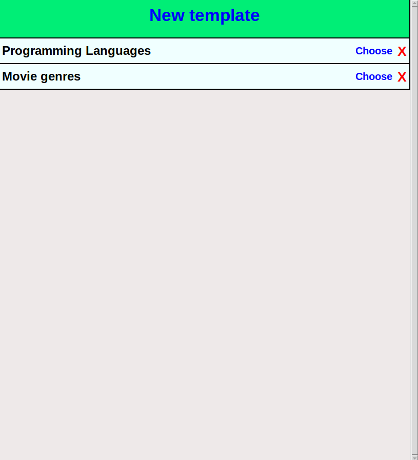

# Käyttöohje

Lataa projektin viimeisin [release](https://github.com/fialco/ot-harjoitustyo/releases) valitsemalla _Assets_-osiosta _Source code_.

## Konfigurointi

Tietokannassa käytettävän tiedoston nimeä voi halutessaan konfiguroida käynnistyshakemistossa _.env_-tiedostossa. _.env_-tiedostosta ja testeihin käytettävässä _.env.test_-tiedostosta on valmiiksi templatet joita voi halutessaan käyttää nimeämällä templatet uusiksi poistamalla tiedostojen lopusta _.template_. Tietokannat luodaan automaattisesti _data_-hakemistoon, jos niitä ei siellä vielä ole. Tiedoston muoto on seuraava:

```
DATABASE_FILENAME=database.sqlite
```

## Ohjelman käynnistys

<b>HUOM! Kaikki komennot ajetaan tier-list-app hakemistossa.</b>

Siirry tier-list-app hakemistoon ja asenna riippuvuudet komennolla:

```bash
poetry install
```

Uudelleennimeä <b>.env.template .env</b> tiedostoksi ja <b>.env.test.template .env.test</b> tiedostoksi

Suorita alustavat toimenpiteet komennolla:

```bash
poetry run invoke build
```

Käynnistä sovellus komennolla:

```bash
poetry run invoke start
```

## Valmiin tier listin käyttö

Sovellus käynnistyy listanäkymään valmiista tehdyistä tier list pohjista:



Valmiin pohjan käyttö valitaan "Choose"-nappia painamalla jolla siirrytään haluttuun tier listiin.


Tier listin eri asioita liikuttaa hiirellä haluamiinsa tiereihin.

Paluu takaisin listanäkymään tapahtuu "Back"-nappia painamalla.

## Uuden tier list pohjan teko

Uuden pohjan tekoon siirrytään listanäkymässä "New template"-painikkeella.


Pohjan nimen voi valita klikkaamalla "Click here to name the tier list"-painiketta jolloin avautuu uusi ikkuna.


Tierien nimiä voi vaihtaa klikkaamalla nimeä ja kirjoittamalla uusi nimi tekstikenttään.

Kuvia pohjaan voi lisätä vetämällä ja tiputtamalla halutun kuvan tai kuvat "Drag image(s) here"-laatikoon.


Valmis pohja tallennetaan "Create"-nappia painamalla ja on nyt valittavissa listanäkymässä.


## Tier listin poisto

Tier listin voi halutessaan poistaa painamalla punaista X nappia.


Valmiina olevat pohjat saat takaisin komennolla `poetry run invoke build`.

Kaikki tallennetut kuvat [images](../data/images/)-hakemistossa säilyvät.