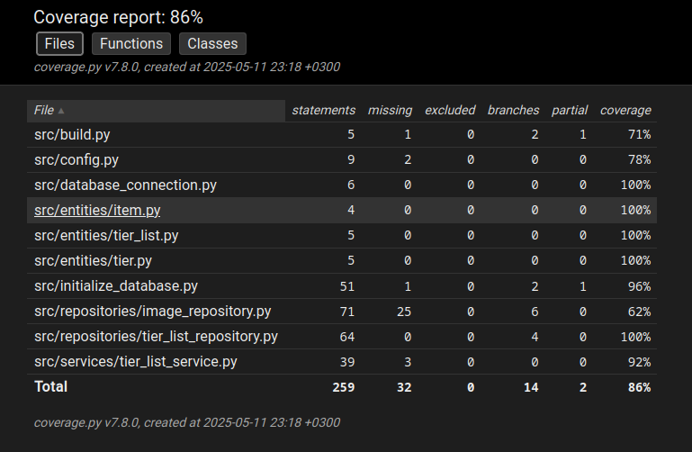

# Testausdokumentti

Ohjelmaa on testattu sekä pytestin automatisoiduilla yksikkö- ja integraatiotesteillä. Lisäksi järjestelmätason testejä on suoritettu manuaalisesti.

## Yksikkö- ja integraatiotestaus

### Sovelluslogiikka

Sovelluslogiikasta vastaavaa `TierListService`-luokkaa testataan [TestTierListService](../src/tests/services/tier_list_service_test.py)-testiluokalla. `TierListService`-olio alustetaan injektoimalla riippuvuksiksi repositorio-oliot, jossa tallennus tapahtuu tietokantojen sijasta muistiin. Testejä varten on käytössä omat luokat `FakeTierListRepository` ja `FakeImageRepository`.

### Repositorio-luokat

Repositorio-luokkia `TierListRepository` ja `ImageRepository` testestataan vain testejä varten tehdyillä tiedostoilla. `TierListRepository`:n käyttämän tiedoston nimi on konfiguroitu _.env.test_-tiedostoon. `ImageRepository`:a testatessa hyödynnetään [test_images](../data/test_images/)-hakemistoa.

`TierListRepository`-luokkaa testataan [TestTierListRepository](../src/tests/repositories/tier_list_repository_test.py)-testiluokalla ja `ImageRepository`-luokkaa [TestImageRepository](../src/tests/repositories/image_repository_test.py)-testiluokalla.

### Testauskattavuus

Sovelluksen testauksen haarautumakattavuus on 78%. Käyttöliittymän tiedostoja ei ole otettu mukaan testeihin.

Testaamatta jäivät _build.py_- ja _initialize_database.py_-tiedostojen jotka olisi voinut jättää kokonaan testaamatta. Suurimmat puutteet jäivät `ImageRepository`-luokkan testauksessa ajanpuutteen ja hankaluuden takia. Esimerkiksi kuvankaappauksen testaaminen ilman erikseen alustettua Tkinter canvasta ei oikein onnistu. Testatessa text_to_image() metodia testeille ei oltu valmisteltu omaa tallennus paikkaa ja kuvat päätyvät samaan paikkaan kun normaalissa käytössä.

## Järjestelmätestaus

Sovelluksen järjestelmätestausta on pyritty suorittamaan mahdollisimman laajasti manuaalisesti.

### Asennus ja konfigurointi

Sovellusta on testattu [käyttöohjeen](./kayttoohje.md) kuvaamalla tavalla Linux-ympäristössä.

Sovellusta on testattu sekä itse luoduilla, että valmiilla pohjilla.

### Toiminnallisuudet

Kaikki [määrittelydokumentissa](./vaatimusmaarittely.md) listatut valmiit toiminnallisuudet on käyty läpi. Syötekentät on yritetty täyttää virheellisillä arvoilla kuten liian pitkillä tai lyhyillä arvoilla. Lisäksi on yritetty tiputtaa kuvaksi uuden pohjan luonnin aikana tiedostoja joiden formaattia ei tueta.

## Sovelluksen laadulliset puutteet

Sovelluksessa ei ole valmisteltu virheilmoituksia jos:

- Konfiguraatiossa tarvittaviin tiedostoihin ei ole luku/kirjoitusoikeuksia
- Jos tietokantaa ei ole alustettu, eli `python -m poetry run invoke build`-komentoa ei ole suoritettu